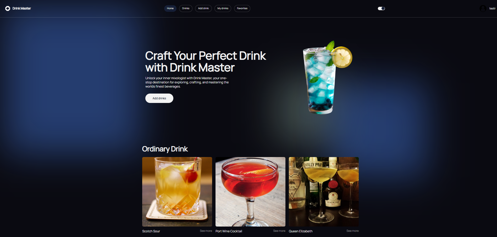
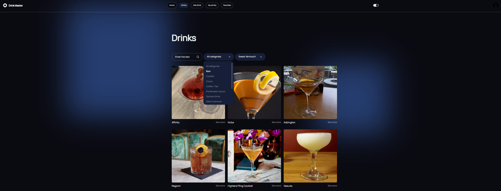
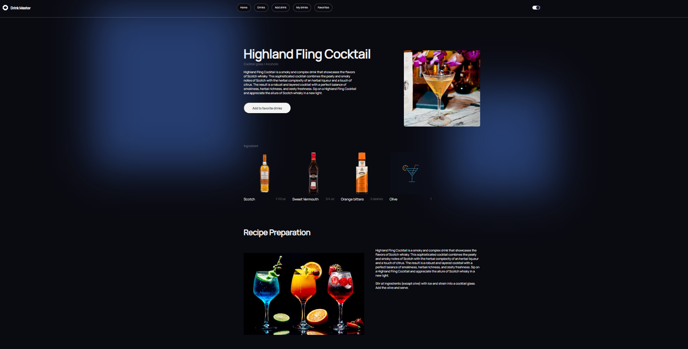
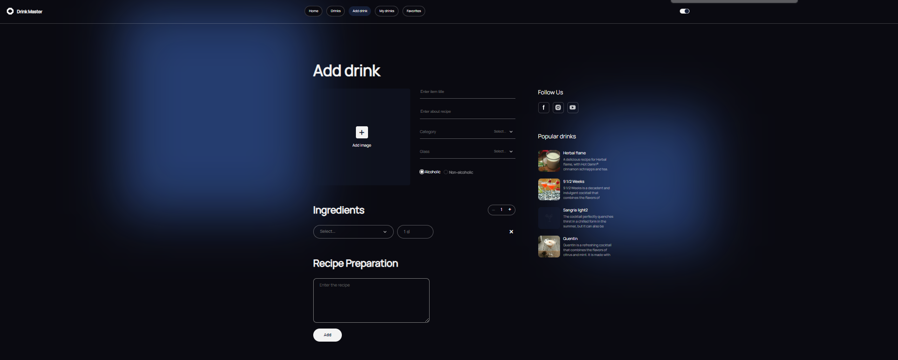
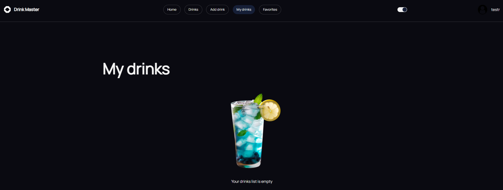
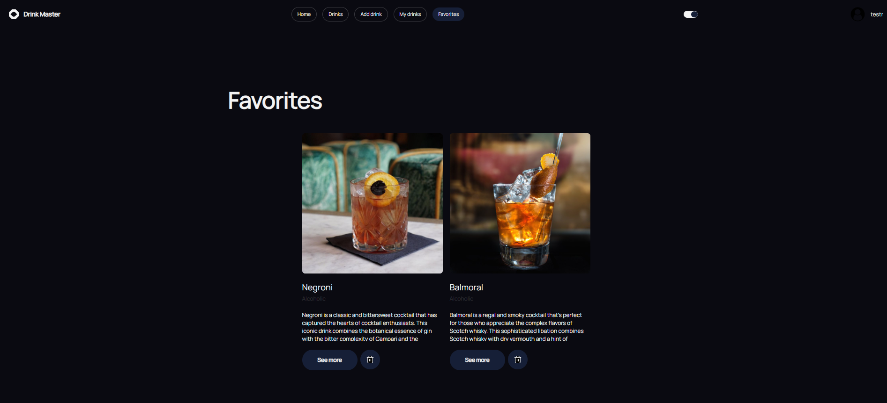

# Team project DrinkMaster

A team project on creating an application for searching and creating cocktails. 

The project utilized HTML, CSS, JavaScript, React.js, Redux, and Node.js technologies.

**Home page**

**Drinks page**

**See more**

**Add drink page**

**My drinks page**

**Favorites page**

# API backend documentation

[DrinkMaster V1 API docs](https://drinks-whm4.onrender.com/api-docs/#/)